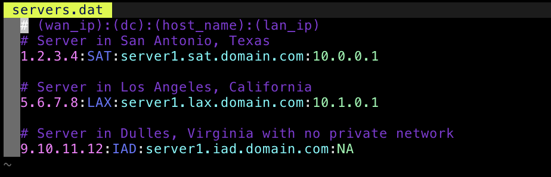

# Wat?
It's [servers.dat](http://code.svn.wordpress.org/servermattic/etc/servers.dat) syntax highlighting.  This will mean almost nothing to almost everybody...

# What's it look like?

# Installation

## Normal Vim

Put these files in these places

1. [ftdetect/serversdat.vim](ftdetect/serversdat.vim) -> `~/.vim/ftdetect/serversdat.vim `
2. [syntax/serversdat.vim](syntax/serversdat.vim) -> `~/.vim/syntax/serversdat.vim`
3. [ftplugin/serversdat.vim](ftplugin/serversdat.vim) -> `~/.vim/ftplugin/serversdat.vim`

## [vim-plug](https://github.com/junegunn/vim-plug)

Add `Plug 'apokalyptik/vim-servers-dot-dat'` to your ~/.vimrc and run `:PlugInstall`

## [Vundle](https://github.com/VundleVim/Vundle.vim)

Add `Plugin 'apokalyptik/vim-servers-dot-dat'` to your ~/.vimrc and run `:PluginInstall`
